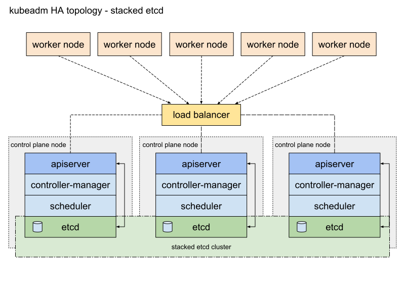

# kubeadm-ansible
通过ansible playbook和kubeadm部署高可用kubernetes集群.

## 高可用架构


### 执行命令
```shell script
# 部署集群
ansible-playbook -i hosts.ini site.yaml
# 删除集群
ansible-playbook -i hosts.ini reset-site.yaml
# 仅执行扩容
ansible-playbook -i hosts.ini  site.yaml --tags node  -v 
```

### 新建集群 tasks
```shell script

  play #1 (kube-cluster): kube-cluster  TAGS: []
    tasks:
      docker : Install Docker container engine  TAGS: [docker]
      docker : Copy Docker engine service file  TAGS: [docker]
      docker : Copy Docker environment config file      TAGS: [docker]
      docker : Add any insecure registries to Docker config     TAGS: [docker]
      docker : Add registry to Docker config    TAGS: [docker]
      docker : Enable and check Docker service  TAGS: [docker]

  play #2 (master): master      TAGS: []
    tasks:
      commons/pre-install : Install Kubernetes packages TAGS: [master]
      commons/pre-install : Remove firewalld    TAGS: [master]
      commons/pre-install : Disable system swap TAGS: [master]
      commons/pre-install : Remove current swaps from fstab     TAGS: [master]
      commons/pre-install : Disable swappiness and pass bridged IPv4 traffic to iptable's chains        TAGS: [master]
      commons/pre-install : 确保已卸载ntp       TAGS: [master]
      commons/pre-install : 安装 chrony TAGS: [master]
      commons/pre-install : 配置 chrony server  TAGS: [master]
      commons/pre-install : 启动 chrony server  TAGS: [master]
      commons/pre-install : Create service drop-in directory    TAGS: [master]
      commons/pre-install : Copy kubeadm conf to drop-in directory      TAGS: [master]
      commons/pre-install : Reload kubelet daemon       TAGS: [master]
      kubernetes/master : Check if kubeadm has already run      TAGS: [master]
      kubernetes/master : Init cluster if needed        TAGS: [master]
      kubernetes/master : Join cluster if needed        TAGS: [master]
      kubernetes/master : Create Kubernetes config directory    TAGS: [master]
      kubernetes/master : Copy admin.conf to Home directory     TAGS: [master]

  play #3 (node): node  TAGS: []
    tasks:
      commons/pre-install : Install Kubernetes packages TAGS: [node]
      commons/pre-install : Remove firewalld    TAGS: [node]
      commons/pre-install : Disable system swap TAGS: [node]
      commons/pre-install : Remove current swaps from fstab     TAGS: [node]
      commons/pre-install : Disable swappiness and pass bridged IPv4 traffic to iptable's chains        TAGS: [node]
      commons/pre-install : 确保已卸载ntp       TAGS: [node]
      commons/pre-install : 安装 chrony TAGS: [node]
      commons/pre-install : 配置 chrony server  TAGS: [node]
      commons/pre-install : 启动 chrony server  TAGS: [node]
      commons/pre-install : Create service drop-in directory    TAGS: [node]
      commons/pre-install : Copy kubeadm conf to drop-in directory      TAGS: [node]
      commons/pre-install : Reload kubelet daemon       TAGS: [node]
      kubernetes/node : Check if kubelet.conf exists    TAGS: [node]
      kubernetes/node : Get ca cert hash        TAGS: [node]
      set_fact  TAGS: [node]
      kubernetes/node : Join to cluster if needed       TAGS: [node]
      kubernetes/node : Enable and check kubelet service        TAGS: [node]
```

### 查看集群
```shell script
[root@master1 ~]# kubectl get node
NAME             STATUS     ROLES    AGE   VERSION
192.168.202.21   NotReady   master   30m   v1.18.3
192.168.202.22   NotReady   master   29m   v1.18.3
192.168.202.23   NotReady   master   28m   v1.18.3

[root@master1 ~]# kubectl get pod -n kube-system
NAME                                     READY   STATUS    RESTARTS   AGE
etcd-192.168.202.21                      1/1     Running   0          12m
etcd-192.168.202.22                      1/1     Running   0          23m
etcd-192.168.202.23                      1/1     Running   0          29m
kube-apiserver-192.168.202.21            1/1     Running   0          30m
kube-apiserver-192.168.202.22            1/1     Running   0          30m
kube-apiserver-192.168.202.23            1/1     Running   0          28m
kube-controller-manager-192.168.202.21   1/1     Running   0          12m
kube-controller-manager-192.168.202.22   1/1     Running   0          30m
kube-controller-manager-192.168.202.23   1/1     Running   0          28m
kube-scheduler-192.168.202.21            1/1     Running   1          30m
kube-scheduler-192.168.202.22            1/1     Running   0          30m
kube-scheduler-192.168.202.23            1/1     Running   0          28m

[root@master1 ~]# kubectl get cm -n kube-system
NAME                                 DATA   AGE
extension-apiserver-authentication   6      31m
kubeadm-config                       2      31m
kubelet-config-1.18                  1      31m

[root@master1 ~]# kubectl get ep -n kube-system
NAME                      ENDPOINTS   AGE
kube-controller-manager   <none>      31m
kube-scheduler            <none>      31m

[root@master1 ~]# kubectl get svc 
NAME         TYPE        CLUSTER-IP   EXTERNAL-IP   PORT(S)   AGE
kubernetes   ClusterIP   10.96.0.1    <none>        443/TCP   31m


```

### 验证集群可用性
```shell script
# 模拟某个etcd static pod退出,主自动迁移
[root@master1 ~]# mv /etc/kubernetes/manifests/etc.yml ~
[root@master1 ~]# ETCDCTL_API=3 etcdctl -w table --endpoints 192.168.202.21:2379,192.168.202.22:2379,192.168.202.23:2379 \
  --cacert /etc/kubernetes/pki/etcd/ca.crt \
  --cert /etc/kubernetes/pki/etcd/server.crt \
  --key /etc/kubernetes/pki/etcd/server.key  endpoint status

{"level":"warn","ts":"2020-06-15T06:33:22.092Z","caller":"clientv3/retry_interceptor.go:61","msg":"retrying of unary invoker failed","target":"passthrough:///192.168.202.21:2379","attempt":0,"error":"rpc error: code = DeadlineExceeded desc = latest connection error: connection error: desc = \"transport: Error while dialing dial tcp 192.168.202.21:2379: connect: connection refused\""}
Failed to get the status of endpoint 192.168.202.21:2379 (context deadline exceeded)
+---------------------+------------------+---------+---------+-----------+------------+-----------+------------+--------------------+--------+
|      ENDPOINT       |        ID        | VERSION | DB SIZE | IS LEADER | IS LEARNER | RAFT TERM | RAFT INDEX | RAFT APPLIED INDEX | ERRORS |
+---------------------+------------------+---------+---------+-----------+------------+-----------+------------+--------------------+--------+
| 192.168.202.22:2379 | 30bdd535d0dbf72d |   3.4.3 |  2.7 MB |     false |      false |         9 |       2315 |               2315 |        |
| 192.168.202.23:2379 |  aa166945f1ef0b8 |   3.4.3 |  2.7 MB |      true |      false |         9 |       2315 |               2315 |        |
+---------------------+------------------+---------+---------+-----------+------------+-----------+------------+--------------------+--------+

# 模拟 kube-controller-manager static pod退出,重新选主
[root@master1 ~]# mv /etc/kubernetes/manifests/kube-controller-manager.yaml ~
[root@master1 ~]# kubectl get ep kube-controller-manager -oyaml  -n kube-system  |grep holderIdentity
    control-plane.alpha.kubernetes.io/leader: '{"holderIdentity":"master2_b05d855f-6931-4fe0-aa9f-5e8d276c00ee","leaseDurationSeconds":15,"acquireTime":"2020-06-15T06:34:33Z","renewTime":"2020-06-15T06:40:35Z","leaderTransitions":2}'
```

### 修改证书有效期

> 安装中使用的kubeadm是基于kabeadm-1.18.3源码重编译的版本,将证书有效期调整为100年;
> 编译方式参考文档[<<修改kubeadm 证书有效期>>](https://doc.myoas.com/pages/viewpage.action?pageId=268819673).

```shell script
# 查看证书有效期
[root@master01 ~]# kubeadm alpha certs check-expiration 
W0615 07:45:38.096669  120078 configset.go:76] Warning: No kubeproxy.config.k8s.io/v1alpha1 config is loaded. Continuing without it: configmaps "kube-proxy" not found

CERTIFICATE                EXPIRES                  RESIDUAL TIME   CERTIFICATE AUTHORITY   EXTERNALLY MANAGED
admin.conf                 May 22, 2120 11:45 UTC   99y                                     no      
apiserver                  May 22, 2120 11:45 UTC   99y             ca                      no      
apiserver-etcd-client      May 22, 2120 11:45 UTC   99y             etcd-ca                 no      
apiserver-kubelet-client   May 22, 2120 11:45 UTC   99y             ca                      no      
controller-manager.conf    May 22, 2120 11:45 UTC   99y                                     no      
etcd-healthcheck-client    May 22, 2120 11:45 UTC   99y             etcd-ca                 no      
etcd-peer                  May 22, 2120 11:45 UTC   99y             etcd-ca                 no      
etcd-server                May 22, 2120 11:45 UTC   99y             etcd-ca                 no      
front-proxy-client         May 22, 2120 11:45 UTC   99y             front-proxy-ca          no      
scheduler.conf             May 22, 2120 11:45 UTC   99y                                     no      

CERTIFICATE AUTHORITY   EXPIRES                  RESIDUAL TIME   EXTERNALLY MANAGED
ca                      May 22, 2120 11:45 UTC   99y             no      
etcd-ca                 May 22, 2120 11:45 UTC   99y             no      
front-proxy-ca          May 22, 2120 11:45 UTC   99y             no
```